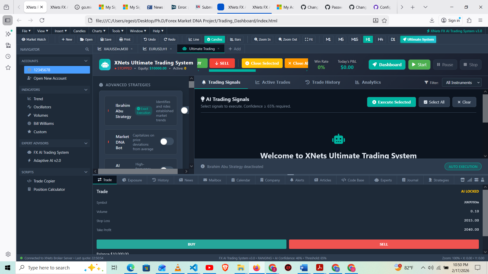

# XNets Ultimate Trading System v3.0

[](https://zziemwellu.github.io/xnets-ultimate-trading-system/)
[](https://github.com/ZziemWellu/xnets-ultimate-trading-system/stargazers)
[](https://github.com/ZziemWellu/xnets-ultimate-trading-system/blob/main/LICENSE)
[](https://developer.mozilla.org/en-US/docs/Web/HTML)

<div align="center">
  
  <p><em>Professional MT5-Class Trading Platform with AI Integration</em></p>
</div>

## 📋 Table of Contents
- [Overview](#-overview)
- [Key Features](#-key-features)
- [Live Demo](#-live-demo)
- [Screenshots](#-screenshots)
- [System Architecture](#-system-architecture)
- [Installation](#-installation)
- [Quick Start Guide](#-quick-start-guide)
- [Trading Strategies](#-trading-strategies)
- [Risk Management](#-risk-management)
- [Multi-Timeframe Analysis](#-multi-timeframe-analysis)
- [Configuration](#-configuration)
- [Keyboard Shortcuts](#-keyboard-shortcuts)
- [Technologies Used](#-technologies-used)
- [Contributing](#-contributing)
- [License](#-license)
- [Disclaimer](#-disclaimer)
- [Contact](#-contact)

## 🚀 Overview

**XNets Ultimate Trading System** is a professional-grade, browser-based trading platform that replicates and extends the functionality of MetaTrader 5 (MT5). Built entirely with HTML, CSS, and JavaScript, this system provides institutional-grade tools for serious traders, including multi-strategy AI analysis, real-time market scanning, comprehensive risk management, and automated trade execution.

Unlike traditional trading platforms that require installation, this system runs directly in your browser and features a fully interactive interface with live market simulation, making it perfect for strategy testing, education, and demonstration purposes.

## ✨ Key Features

### 🔥 Professional Trading Interface
- **Complete MT5-Style Layout**: Familiar navigation with File, View, Insert, Charts, Tools, Window, and Help menus
- **Multi-Chart Support**: Multiple chart tabs with real-time price updates
- **Market Watch Panel**: Live symbol tracking with bid/ask prices
- **Toolbar with Shortcuts**: Quick access to common functions
- **Status Bar**: Real-time connection status and market information
- **13+ Professional Panels**: Trade, Exposure, History, News, Mailbox, Calendar, Company, Alerts, Articles, Code Base, Experts, Journal, and Strategies

### 🤖 Advanced AI Trading Strategies

#### Ibrahim Abu Strategy (Manual Trading)
- Step-by-step trading checklist
- Break of Structure (BOS) detection
- Area of Interest (AOI) identification
- Candle confirmation patterns
- Trend analysis across multiple timeframes

#### Market DNA Bot (AI Pattern Recognition)
- Classical pattern detection (Double Top/Bottom, Head & Shoulders)
- Harmonic patterns (AB=CD, Gartley, Butterfly, Bat, Crab)
- Elliott Wave pattern recognition
- Real-time pattern scanning
- Confidence scoring for each pattern

#### Additional Strategies
- **Scalping Engine**: High-frequency short-term trading
- **Momentum Trading**: Trend strength analysis
- **Breakout Scanner**: Price breakout detection
- **Mean Reversion**: Counter-trend opportunities

### 📊 Multi-Timeframe Analysis
- Support for 5 timeframes: M5, M15, H1, H4, D1
- Consensus-based signal generation
- Timeframe agreement visualization
- Customizable timeframe selection

### 💼 Professional Risk Management
- **Risk per Trade**: 0.1% to 5% configurable
- **Maximum Daily Loss**: Protection against overtrading
- **Concurrent Trade Limits**: Max 20 trades, configurable
- **Same Symbol Limits**: Max 5 trades per symbol
- **Trailing Stop**: Automatic stop loss adjustment
- **Partial Take Profit**: Multiple TP levels
- **Position Size Calculator**: Automatic lot sizing based on risk
- **Breakeven Management**: Move to breakeven at 1.5R

### 📈 Live Market Simulation
- Real-time price updates for 20+ symbols
- Forex pairs (EURUSD, GBPUSD, USDJPY, etc.)
- Commodities (XAUUSD, XAGUSD, OILUSD)
- Indices (US30, SPX500, NAS100)
- Cryptocurrencies (BTCUSD, ETHUSD)
- Volatility-based price movements
- Trend simulation with random changes

### 📅 Economic Calendar Integration
- High, medium, and low impact events
- Real-time event tracking
- Automatic trading filters during news
- Export functionality (CSV format)
- Forex Factory style interface

### 📊 Comprehensive Analytics
- **Performance Metrics**: Win rate, profit factor, Sharpe ratio
- **Trade History**: Complete record with filtering
- **Strategy Performance**: Per-strategy breakdown
- **Visual Trade Cards**: Progress indicators
- **Export Functionality**: CSV export of trade history

### 🔧 Advanced Features
- **Multiple Account Management**: Switch between demo accounts
- **Execution Modes**: Manual or auto-execution (75%+ confidence)
- **Confidence Level Explanations**: Detailed signal reasoning
- **Ultimate Dashboard**: Comprehensive system overview
- **Keyboard Shortcuts**: Quick access to common functions
- **Sound Notifications**: Audio feedback for signals (optional)

## 🎮 Live Demo

**Experience the platform live:** [https://zziemwellu.github.io/xnets-ultimate-trading-system/](https://zziemwellu.github.io/xnets-ultimate-trading-system/)

No installation required - works in any modern browser!

## 📸 Screenshots

<div align="center">
  <h3>Main Trading Interface</h3>
  
  <p><em>Complete MT5-style layout with chart, navigator, and trading panels</em></p>
  
  <h3>Strategy Control Panel</h3>
  
  <p><em>Advanced strategy configuration and monitoring</em></p>
  
  <h3>Risk Management Dashboard</h3>
  
  <p><em>Comprehensive risk controls and position sizing</em></p>
  
  <h3>Ultimate System Dashboard</h3>
  
  <p><em>Complete system overview with all features</em></p>
</div>

## 🏗️ System Architecture

The platform is built as a single, comprehensive HTML/JavaScript application with a modular architecture:

xnets-ultimate-trading-system/
├── index.html # Main application file (45KB+ of code)
├── Assets/ # Images and screenshots
│ ├── dashboard-preview.png
│ ├── main-interface.png
│ ├── strategy-panel.png
│ ├── risk-management.png
│ └── ultimate-dashboard.png
└── README.md # This file


### Core Components
XNetsUltimateTradingSystem (Main Class)
├── Market Data Engine
│ ├── Real-time price simulation
│ ├── Trend analysis
│ ├── Volatility calculation
│ └── News feed simulation
├── Strategy Manager
│ ├── Ibrahim Abu Strategy
│ ├── Market DNA Bot
│ ├── Scalping Engine
│ ├── Momentum Trading
│ └── Breakout Scanner
├── Risk Management System
│ ├── Position calculator
│ ├── Stop loss/Take profit
│ ├── Trailing stop
│ └── Exposure limits
├── Trading Engine
│ ├── Order execution
│ ├── Trade management
│ ├── P&L calculation
│ └── History tracking
├── UI Components
│ ├── 13 interactive panels
│ ├── Real-time updates
│ ├── Modal windows
│ └── Notification system
└── Analytics Engine
├── Performance metrics
├── Strategy analysis
├── Risk metrics
└── Export functionality


## 💻 Installation

### Method 1: GitHub Pages (Live Demo)
Simply visit: [https://zziemwellu.github.io/xnets-ultimate-trading-system/](https://zziemwellu.github.io/xnets-ultimate-trading-system/)

### Method 2: Local Installation
```bash
# Clone the repository
git clone https://github.com/ZziemWellu/xnets-ultimate-trading-system.git

# Navigate to directory
cd xnets-ultimate-trading-system

# Open in browser (no build needed)
start index.html  # Windows
open index.html   # Mac

Method 3: Download ZIP
Go to repository

Click "Code" → "Download ZIP"

Extract and open index.html in your browser

🎯 Quick Start Guide
1. Initial Setup
Open the platform in your browser

Familiarize yourself with the MT5-style interface

Explore the top navigation menu (File, View, Insert, etc.)

2. Configure Trading Instruments
In the left panel, select your preferred trading instruments

Choose from Forex, Commodities, Indices, or Crypto

Use the "Select All" or group buttons for quick selection

3. Enable Trading Strategies
Navigate to the Strategy Control Panel (left side)

Toggle strategies on/off using the switches

Adjust confidence levels for each strategy

For Ibrahim Abu Strategy, follow the step-by-step checklist

4. Set Risk Parameters
Adjust risk per trade (0.5% recommended for beginners)

Set maximum daily loss limit

Configure concurrent trade limits

Enable trailing stop if desired

5. Start the System
Click the green "Start" button in the header

The system will begin analyzing markets

Trading signals will appear in the right panel

6. Execute Trades
Manual Mode: Review signals and click "Execute"

Auto Mode: Trades execute automatically when confidence >75%

Use quick action buttons for manual trading

7. Monitor Performance
Track active trades in the "Active Trades" tab

View trade history in the "History" tab

Analyze performance metrics in "Analytics"

Check the Ultimate Dashboard for complete overview

🎮 Trading Strategies Detailed
Ibrahim Abu Strategy

Step 1: Check Fundamentals
- Economic calendar events
- News impact analysis
- Market sentiment

Step 2: Identify Trend (4H)
- Uptrend / Downtrend / Ranging
- Trend strength assessment

Step 3: Break of Structure (Lower TF)
- Detect BOS on M30/H1
- Volume confirmation

Step 4: Area of Interest
- Support/resistance levels
- Order blocks
- Fair value gaps

Step 5: Candle Confirmation
- Bullish/Bearish engulfing
- Pin bars
- Inside bars

Market DNA Bot
Classical Patterns: Double Top/Bottom, Head & Shoulders, Triangles

Harmonic Patterns: AB=CD, Gartley, Butterfly, Bat, Crab

Elliott Waves: Wave counting and pattern recognition

Confidence Scoring: 0-100% based on pattern completeness

📊 Risk Management Deep Dive
Position Sizing Formula

Risk Amount = Account Equity × Risk Per Trade
Position Size = Risk Amount ÷ (Entry Price - Stop Loss)

Risk Parameters
Parameter	Range	Default	Description
Risk per Trade	0.1% - 5%	0.5%	Percentage of equity at risk
Max Daily Loss	1% - 10%	3%	Daily stop-loss limit
Max Trades	1 - 20	8	Maximum concurrent positions
Same Symbol	1 - 5	2	Maximum positions per symbol
Trailing Distance	0.1% - 2%	0.2%	Distance for trailing stop
⚙️ Configuration Options
The system includes extensive configuration options in the config object:
// Risk Management
riskPerTrade: 0.005,        // 0.5%
maxDailyLoss: 0.03,         // 3%
maxConcurrentTrades: 8,
trailingStop: false,
partialTakeProfit: [0.5, 0.5],

// Signal Filters
minConfidence: 0.65,
avoidNews: true,
newsImpactLevel: 'medium',

// Execution
mode: 'manual',             // 'manual' or 'auto'
autoExecuteAbove: 0.75,      // Auto-execute above 75% confidence

// Timeframes
activeTimeframes: ['H1', 'H4', 'D1'],

// Instruments
selectedSymbols: ['XAUUSD', 'EURUSD', 'BTCUSD']

⌨️ Keyboard Shortcuts
Shortcut	Action
Ctrl+B	Quick Buy
Ctrl+S	Quick Sell
Ctrl+P	Pause/Resume System
Ctrl+U	Open Ultimate Dashboard
F9	Start System
F12	Stop System
Esc	Close Modals
🛠️ Technologies Used
HTML5: Structure and semantics

CSS3: Custom properties, flexbox, grid, animations

JavaScript (ES6+): Classes, promises, async/await

Font Awesome 6: Icons and visual elements

GitHub Pages: Hosting and deployment

LocalStorage: Preferences persistence

🤝 Contributing
Contributions are welcome! Here's how you can help:

Fork the repository

Create a feature branch: git checkout -b feature/amazing-feature

Commit your changes: git commit -m 'Add amazing feature'

Push to the branch: git push origin feature/amazing-feature

Open a Pull Request

Development Guidelines
Maintain the MT5-style interface consistency

Add comments for complex logic

Update the README with any new features

Test in multiple browsers

📄 License
This project is licensed under the MIT License - see the LICENSE file for details.

MIT License

Copyright (c) 2026 ZziemWellu

Permission is hereby granted, free of charge, to any person obtaining a copy
of this software and associated documentation files...

⚠️ Disclaimer
IMPORTANT: This trading platform is for educational and demonstration purposes only. It is NOT intended for live trading without proper testing and validation.

The market simulation is for demonstration and may not reflect real market conditions

Past performance does not guarantee future results

Trading involves substantial risk of loss

Always test strategies thoroughly in demo accounts before live trading

Consult with a qualified financial advisor before making investment decisions

The creators and contributors are not responsible for any financial losses incurred through the use of this software.

📞 Contact & Support
GitHub Issues: Create an issue

Email: iamzziem@gmail.com

GitHub Profile: @ZziemWellu

🌟 Support the Project
If you find this project useful, please consider:

⭐ Starring the repository

🔗 Sharing it with others

🐛 Reporting bugs or suggesting features

🤝 Contributing code or documentation

<div align="center"> <h3>Made with ❤️ for the trading community</h3> <p> <a href="https://github.com/ZziemWellu">GitHub</a> • <a href="https://zziemwellu.github.io/xnets-ultimate-trading-system/">Live Demo</a> • <a href="https://github.com/ZziemWellu/xnets-ultimate-trading-system/issues">Report Bug</a> </p> <p>© 2026 ZziemWellu. All rights reserved.</p> </div> ```
